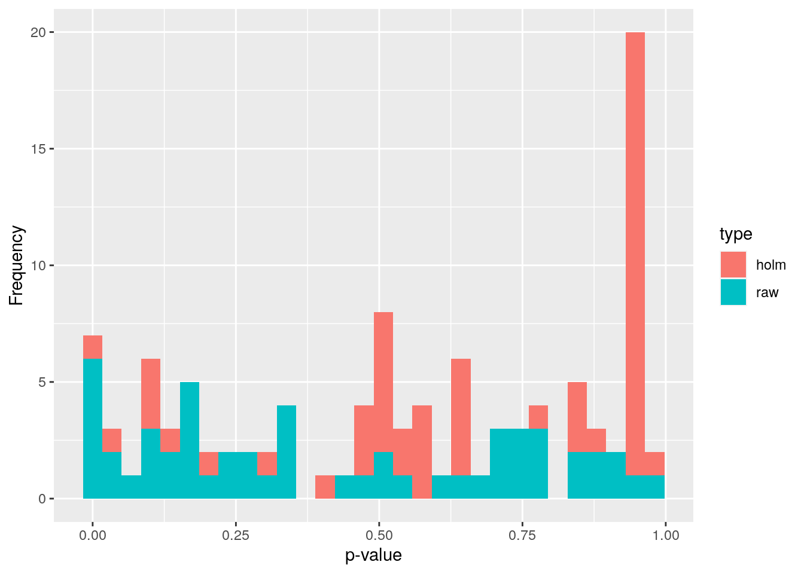
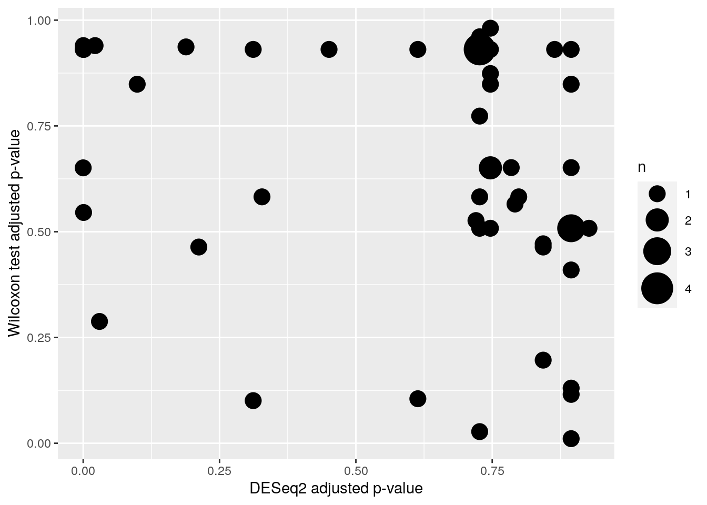
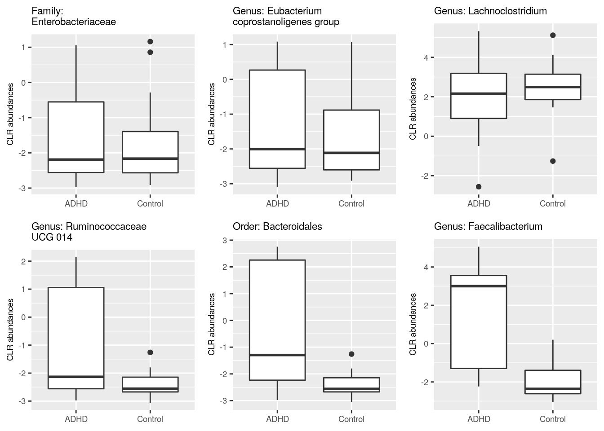
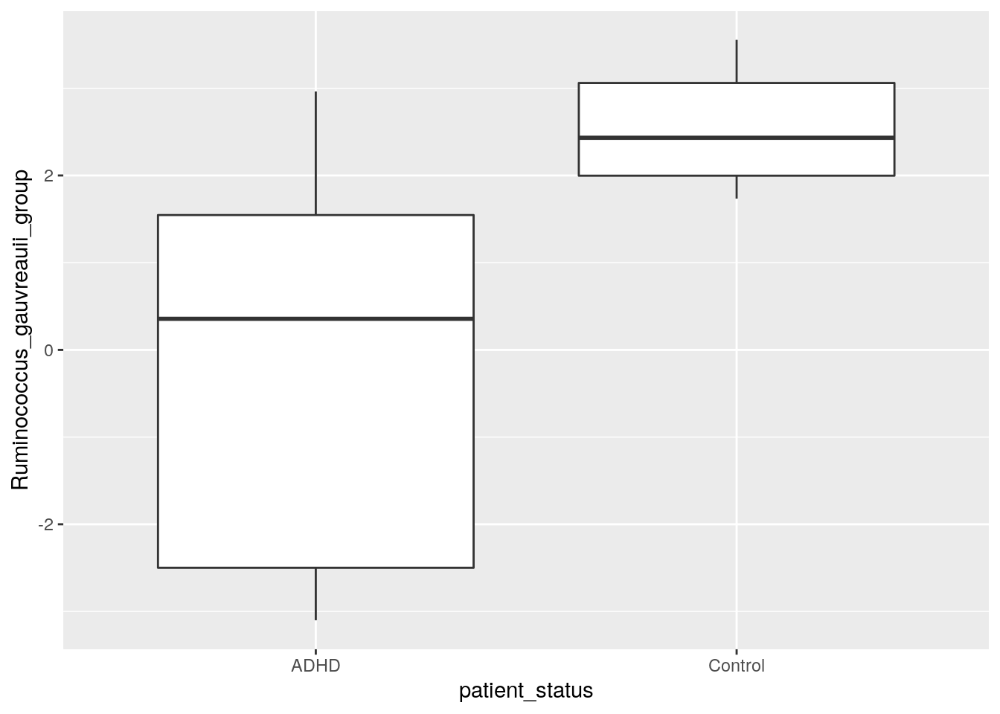

```
## Loading required package: SummarizedExperiment
```

```
## Loading required package: MatrixGenerics
```

```
## Loading required package: matrixStats
```

```
## 
## Attaching package: 'MatrixGenerics'
```

```
## The following objects are masked from 'package:matrixStats':
## 
##     colAlls, colAnyNAs, colAnys, colAvgsPerRowSet, colCollapse,
##     colCounts, colCummaxs, colCummins, colCumprods, colCumsums,
##     colDiffs, colIQRDiffs, colIQRs, colLogSumExps, colMadDiffs,
##     colMads, colMaxs, colMeans2, colMedians, colMins, colOrderStats,
##     colProds, colQuantiles, colRanges, colRanks, colSdDiffs, colSds,
##     colSums2, colTabulates, colVarDiffs, colVars, colWeightedMads,
##     colWeightedMeans, colWeightedMedians, colWeightedSds,
##     colWeightedVars, rowAlls, rowAnyNAs, rowAnys, rowAvgsPerColSet,
##     rowCollapse, rowCounts, rowCummaxs, rowCummins, rowCumprods,
##     rowCumsums, rowDiffs, rowIQRDiffs, rowIQRs, rowLogSumExps,
##     rowMadDiffs, rowMads, rowMaxs, rowMeans2, rowMedians, rowMins,
##     rowOrderStats, rowProds, rowQuantiles, rowRanges, rowRanks,
##     rowSdDiffs, rowSds, rowSums2, rowTabulates, rowVarDiffs, rowVars,
##     rowWeightedMads, rowWeightedMeans, rowWeightedMedians,
##     rowWeightedSds, rowWeightedVars
```

```
## Loading required package: GenomicRanges
```

```
## Loading required package: stats4
```

```
## Loading required package: BiocGenerics
```

```
## 
## Attaching package: 'BiocGenerics'
```

```
## The following objects are masked from 'package:stats':
## 
##     IQR, mad, sd, var, xtabs
```

```
## The following objects are masked from 'package:base':
## 
##     anyDuplicated, append, as.data.frame, basename, cbind, colnames,
##     dirname, do.call, duplicated, eval, evalq, Filter, Find, get, grep,
##     grepl, intersect, is.unsorted, lapply, Map, mapply, match, mget,
##     order, paste, pmax, pmax.int, pmin, pmin.int, Position, rank,
##     rbind, Reduce, rownames, sapply, setdiff, sort, table, tapply,
##     union, unique, unsplit, which.max, which.min
```

```
## Loading required package: S4Vectors
```

```
## 
## Attaching package: 'S4Vectors'
```

```
## The following objects are masked from 'package:base':
## 
##     expand.grid, I, unname
```

```
## Loading required package: IRanges
```

```
## Loading required package: GenomeInfoDb
```

```
## Loading required package: Biobase
```

```
## Welcome to Bioconductor
## 
##     Vignettes contain introductory material; view with
##     'browseVignettes()'. To cite Bioconductor, see
##     'citation("Biobase")', and for packages 'citation("pkgname")'.
```

```
## 
## Attaching package: 'Biobase'
```

```
## The following object is masked from 'package:MatrixGenerics':
## 
##     rowMedians
```

```
## The following objects are masked from 'package:matrixStats':
## 
##     anyMissing, rowMedians
```

```
## Loading required package: SingleCellExperiment
```

```
## Loading required package: TreeSummarizedExperiment
```

```
## Loading required package: Biostrings
```

```
## Loading required package: XVector
```

```
## 
## Attaching package: 'Biostrings'
```

```
## The following object is masked from 'package:base':
## 
##     strsplit
```

```
## Loading required package: ggplot2
```

```
## Loading required package: ggraph
```

```
## 
## Attaching package: 'dplyr'
```

```
## The following objects are masked from 'package:Biostrings':
## 
##     collapse, intersect, setdiff, setequal, union
```

```
## The following object is masked from 'package:XVector':
## 
##     slice
```

```
## The following object is masked from 'package:Biobase':
## 
##     combine
```

```
## The following objects are masked from 'package:GenomicRanges':
## 
##     intersect, setdiff, union
```

```
## The following object is masked from 'package:GenomeInfoDb':
## 
##     intersect
```

```
## The following objects are masked from 'package:IRanges':
## 
##     collapse, desc, intersect, setdiff, slice, union
```

```
## The following objects are masked from 'package:S4Vectors':
## 
##     first, intersect, rename, setdiff, setequal, union
```

```
## The following objects are masked from 'package:BiocGenerics':
## 
##     combine, intersect, setdiff, union
```

```
## The following object is masked from 'package:matrixStats':
## 
##     count
```

```
## The following objects are masked from 'package:stats':
## 
##     filter, lag
```

```
## The following objects are masked from 'package:base':
## 
##     intersect, setdiff, setequal, union
```

# Differential abundance analysis

Here, we analyse abundances with three different methods: **Wilcoxon test** (CLR), **DESeq2**, 
and **ANCOM-BC**. All of these test statistical differences between groups. 
We will analyse Genus level abundances. 

We might want to first perform prevalence filtering to reduce the amount of multiple tests. In this particular dataset, all genera pass a prevalence threshold of 10%, therefore, we do not perform filtering.

## Wilcoxon test

A Wilcoxon test estimates the difference in an outcome between two groups. It is a
non-parametric alternative to a t-test, which means that the Wilcoxon test
does not make any assumptions about the data.

Let's first combine the data for the testing purpose.


```r
# Agglomerates data to Genus level
tse_genus <- agglomerateByRank(tse, rank = "Genus")

# Perform clr transformation. A Pseudocount of 1 needs to be added, 
# because the data contains zeros and the clr transformation includes a 
# log transformation.
tse_genus <- transformCounts(tse_genus, method = "clr", pseudocount = 1)

# Does transpose, so samples are in rows, then creates a data frame.
abundance_analysis_data <- data.frame(t(assay(tse_genus, "clr")))
# We will analyse whether abundances differ depending on the"patient_status".
# There are two groups: "ADHD" and "control". 
# Let's include that to the data frame.
abundance_analysis_data <- cbind(
  abundance_analysis_data, 
  patient_status = colData(tse_genus)$patient_status
)
```

Now we can start with the Wilcoxon test. We test all the taxa by looping through columns,
and store individual p-values to a vector. Then we create a data frame from collected
data.

The code below does the Wilcoxon test only for columns that contain abundances, 
not for columns that contain patient status.


```r
genera <- names(abundance_analysis_data[, !names(abundance_analysis_data) %in% "patient_status"])

wilcoxon_p <- c() # Initialize empty vector for p-values

# Do "for loop" over selected column names
for (i in genera) {

  result <- wilcox.test(abundance_analysis_data[, i] ~ patient_status,
                        data = abundance_analysis_data)
  
  # Stores p-value to the vector with this column name
  wilcoxon_p[[i]]  <- result$p.value

}

wilcoxon_p <- data.frame(taxa =  names(wilcoxon_p),
                         p_raw = unlist(wilcoxon_p))
```

Multiple tests were performed. These are not independent, so we need
to adjust p-values for multiple testing. Otherwise, we would increase
the chance of a type I error drastically depending on our p-value
threshold. By applying a p-value adjustment, we can keep the false
positive rate at a level that is acceptable. What is acceptable
depends on our research goals. Here we use the fdr method, but there
are several other methods as well.


```r
wilcoxon_p$p_adjusted <- p.adjust(wilcoxon_p$p_raw, method = "fdr")
```


```r
# prepare a dataframe to plot p values
df <- data.frame(x = c(wilcoxon_p$p_raw, wilcoxon_p$p_adjusted), 
                type=rep(c("raw", "holm"),
		c(length(wilcoxon_p$p_raw),
		  length(wilcoxon_p$p_adjusted))))

# make a histrogram of p values and adjusted p values
wilcoxon_plot <- ggplot(df) +
  geom_histogram(aes(x=x, fill=type)) +
  labs(x = "p-value", y = "Frequency") 

wilcoxon_plot
```

```
## `stat_bin()` using `bins = 30`. Pick better value with `binwidth`.
```



## DESeq2

Our second analysis method is [DESeq2](https://genomebiology.biomedcentral.com/articles/10.1186/s13059-014-0550-8). This method performs the data
normalization automatically. It also takes care of the p-value
adjustment, so we don't have to worry about that.

DESeq2 utilizes a negative binomial distribution to detect differences in
read counts between groups. Its normalization takes care of the
differences between library sizes and compositions. DESeq2 analysis
includes multiple steps, but they are done automatically. More
information can be found, e.g., from Harvard Chan Bioinformatic Core's
tutorial [Introduction to DGE -
ARCHIVED](https://hbctraining.github.io/DGE_workshop/lessons/04_DGE_DESeq2_analysis.html)

Now let us show how to do this. First, run the DESeq2 analysis.


```r
# Creates DESeq2 object from the data. Uses "patient_status" to create groups. 
ds2 <- DESeqDataSet(tse_genus, ~patient_status)
```

```
## converting counts to integer mode
```

```
## Warning in DESeqDataSet(tse_genus, ~patient_status): 2 duplicate rownames were
## renamed by adding numbers
```

```
## Warning in DESeqDataSet(tse_genus, ~patient_status): some variables in design
## formula are characters, converting to factors
```

```r
# Does the analysis
dds <- DESeq(ds2)
```

```
## estimating size factors
```

```
## estimating dispersions
```

```
## gene-wise dispersion estimates
```

```
## mean-dispersion relationship
```

```
## final dispersion estimates
```

```
## fitting model and testing
```

```
## -- replacing outliers and refitting for 11 genes
## -- DESeq argument 'minReplicatesForReplace' = 7 
## -- original counts are preserved in counts(dds)
```

```
## estimating dispersions
```

```
## fitting model and testing
```

```r
# Gets the results from the object
res <- results(dds)

# Creates a data frame from results
df <- as.data.frame(res)

# Adds taxon column that includes names of taxa
df$taxon <- rownames(df)

# Orders the rows of data frame in increasing order firstly based on column
# "log2FoldChange" and secondly based on "padj" column
df <- df %>% arrange(log2FoldChange, padj)

knitr::kable(head(df)) %>% 
  kableExtra::kable_styling("striped") %>% 
  kableExtra::scroll_box(width = "100%")
```

<div style="border: 1px solid #ddd; padding: 5px; overflow-x: scroll; width:100%; "><table class="table table-striped" style="margin-left: auto; margin-right: auto;">
 <thead>
  <tr>
   <th style="text-align:left;">   </th>
   <th style="text-align:right;"> baseMean </th>
   <th style="text-align:right;"> log2FoldChange </th>
   <th style="text-align:right;"> lfcSE </th>
   <th style="text-align:right;"> stat </th>
   <th style="text-align:right;"> pvalue </th>
   <th style="text-align:right;"> padj </th>
   <th style="text-align:left;"> taxon </th>
  </tr>
 </thead>
<tbody>
  <tr>
   <td style="text-align:left;"> Genus:Ruminococcaceae_UCG-014 </td>
   <td style="text-align:right;"> 22.548297 </td>
   <td style="text-align:right;"> -24.891267 </td>
   <td style="text-align:right;"> 2.460684 </td>
   <td style="text-align:right;"> -10.115589 </td>
   <td style="text-align:right;"> 0.0000000 </td>
   <td style="text-align:right;"> 0.0000000 </td>
   <td style="text-align:left;"> Genus:Ruminococcaceae_UCG-014 </td>
  </tr>
  <tr>
   <td style="text-align:left;"> Order:Bacteroidales </td>
   <td style="text-align:right;"> 40.353733 </td>
   <td style="text-align:right;"> -9.241798 </td>
   <td style="text-align:right;"> 2.136205 </td>
   <td style="text-align:right;"> -4.326270 </td>
   <td style="text-align:right;"> 0.0000152 </td>
   <td style="text-align:right;"> 0.0002730 </td>
   <td style="text-align:left;"> Order:Bacteroidales </td>
  </tr>
  <tr>
   <td style="text-align:left;"> Genus:Faecalibacterium </td>
   <td style="text-align:right;"> 231.079502 </td>
   <td style="text-align:right;"> -7.074433 </td>
   <td style="text-align:right;"> 1.745612 </td>
   <td style="text-align:right;"> -4.052694 </td>
   <td style="text-align:right;"> 0.0000506 </td>
   <td style="text-align:right;"> 0.0006835 </td>
   <td style="text-align:left;"> Genus:Faecalibacterium </td>
  </tr>
  <tr>
   <td style="text-align:left;"> Genus:Catabacter </td>
   <td style="text-align:right;"> 18.045614 </td>
   <td style="text-align:right;"> -6.615454 </td>
   <td style="text-align:right;"> 1.716150 </td>
   <td style="text-align:right;"> -3.854823 </td>
   <td style="text-align:right;"> 0.0001158 </td>
   <td style="text-align:right;"> 0.0012508 </td>
   <td style="text-align:left;"> Genus:Catabacter </td>
  </tr>
  <tr>
   <td style="text-align:left;"> Genus:Butyricicoccus </td>
   <td style="text-align:right;"> 2.392885 </td>
   <td style="text-align:right;"> -5.179608 </td>
   <td style="text-align:right;"> 2.948055 </td>
   <td style="text-align:right;"> -1.756957 </td>
   <td style="text-align:right;"> 0.0789251 </td>
   <td style="text-align:right;"> 0.3278426 </td>
   <td style="text-align:left;"> Genus:Butyricicoccus </td>
  </tr>
  <tr>
   <td style="text-align:left;"> Order:Gastranaerophilales </td>
   <td style="text-align:right;"> 2.067972 </td>
   <td style="text-align:right;"> -3.054975 </td>
   <td style="text-align:right;"> 2.938641 </td>
   <td style="text-align:right;"> -1.039588 </td>
   <td style="text-align:right;"> 0.2985315 </td>
   <td style="text-align:right;"> 0.7269742 </td>
   <td style="text-align:left;"> Order:Gastranaerophilales </td>
  </tr>
</tbody>
</table></div>


## ANCOM-BC

[The analysis of composition of microbiomes with bias correction (ANCOM-BC)](https://www.nature.com/articles/s41467-020-17041-7) 
is a recently developed method for differential abundance testing. It is based on an 
[earlier published approach](https://www.ncbi.nlm.nih.gov/pmc/articles/PMC4450248/). 
The former version of this method could be recommended as part of several approaches:
A [recent study](https://www.biorxiv.org/content/10.1101/2021.05.10.443486v1.full) 
compared several mainstream methods and found that among another method, ANCOM produced the most consistent results and is probably a conservative approach. Please note that based on this and other comparisons, no single method can be recommended across all datasets. Rather, it could be recommended to apply several methods and look at the overlap/differences. 

As the only method, ANCOM-BC incorporates the so called *sampling fraction* into the model. The latter term could be empirically estimated by the ratio of the library size to the microbial load. Variations in this sampling fraction would bias differential abundance analyses if ignored. Furthermore, this method provides p-values, and confidence intervals for each taxon. 
It also controls the FDR and it is computationally simple to implement. 

As we will see below, to obtain results, all that is needed is to pass 
a phyloseq object to the `ancombc()` function. Therefore, below we first convert 
our `tse` object to a `phyloseq` object. Then, we specify the formula. In this formula, other covariates could potentially be included to adjust for confounding. 
Please check the [function documentation](https://rdrr.io/github/FrederickHuangLin/ANCOMBC/man/ancombc.html) 
to learn about the additional arguments that we specify below. Also, see [here](https://www.bioconductor.org/packages/release/bioc/vignettes/ANCOMBC/inst/doc/ANCOMBC.html) for another example for more than 1 group comparison.


```r
# currently, ancombc requires the phyloseq format, but we can convert this easily
pseq <- makePhyloseqFromTreeSummarizedExperiment(tse)
pseq_genus <- phyloseq::tax_glom(pseq, taxrank = "Genus")

out = ancombc(
  phyloseq = pseq_genus, 
  formula = "patient_status", 
  p_adj_method = "holm", 
  zero_cut = 0.90, # by default prevalence filter of 10% is applied
  lib_cut = 0, 
  group = "patient_status", 
  struc_zero = TRUE, 
  neg_lb = TRUE, 
  tol = 1e-5, 
  max_iter = 100, 
  conserve = TRUE, 
  alpha = 0.05, 
  global = TRUE
)
res <- out$res
```

The object `out` contains all relevant information. Again, see the 
[documentation of the function](https://rdrr.io/github/FrederickHuangLin/ANCOMBC/man/ancombc.html) 
under **Value** for an explanation of all the output objects. Our question can be answered 
by looking at the `res` object, which now contains dataframes with the coefficients, 
standard errors, p-values and q-values. Conveniently, there is a dataframe `diff_abn`. 
Here, we can find all differentially abundant taxa. Below we show the first 6 entries of this dataframe:  


```r
knitr::kable(head(res$diff_abn)) %>% kableExtra::kable_styling("striped") %>% 
  kableExtra::scroll_box(width = "100%")
```

<div style="border: 1px solid #ddd; padding: 5px; overflow-x: scroll; width:100%; "><table class="table table-striped" style="margin-left: auto; margin-right: auto;">
 <thead>
  <tr>
   <th style="text-align:left;">   </th>
   <th style="text-align:left;"> patient_statusControl </th>
  </tr>
 </thead>
<tbody>
  <tr>
   <td style="text-align:left;"> 172647198 </td>
   <td style="text-align:left;"> FALSE </td>
  </tr>
  <tr>
   <td style="text-align:left;"> 1726478 </td>
   <td style="text-align:left;"> FALSE </td>
  </tr>
  <tr>
   <td style="text-align:left;"> 172647201 </td>
   <td style="text-align:left;"> FALSE </td>
  </tr>
  <tr>
   <td style="text-align:left;"> 17264798 </td>
   <td style="text-align:left;"> FALSE </td>
  </tr>
  <tr>
   <td style="text-align:left;"> 172647195 </td>
   <td style="text-align:left;"> FALSE </td>
  </tr>
  <tr>
   <td style="text-align:left;"> 1726472 </td>
   <td style="text-align:left;"> FALSE </td>
  </tr>
</tbody>
</table></div>

In total, this method detects 13 differentially abundant taxa.

## Comparison of the methods

Let's compare results that we got from the methods.
As we can see from the scatter plot, DESeq2 gives lower p-values than Wilcoxon test. 


```r
mf <- data.frame(df$padj, wilcoxon_p$p_adjusted)
p <- ggplot(mf, aes(x = df$padj, y = wilcoxon_p$p_adjusted)) +
       labs(x = "DESeq2 adjusted p-value", y = "Wilcoxon test adjusted p-value") +
       geom_count() +
 scale_size_area(max_size = 10)

print(p)
```



Prints number of p-values under 0.05


```r
print(paste0("Wilcoxon test p-values under 0.05: ", sum(wilcoxon_p$p_adjusted<0.05, na.rm = TRUE), "/", length(wilcoxon_p$p_adjusted)))
```

```
## [1] "Wilcoxon test p-values under 0.05: 2/54"
```

```r
print(paste0("DESeq2 p-values under 0.05: ", sum(df$padj<0.05, na.rm = TRUE), "/", length(df$padj)))
```

```
## [1] "DESeq2 p-values under 0.05: 7/54"
```

```r
print(paste0("ANCOM p-values under 0.05: ", sum(out$res$diff_abn$patient_statusControl), "/", length(out$res$diff_abn$patient_statusControl)))
```

```
## [1] "ANCOM p-values under 0.05: 13/49"
```

We can also look at the intersection of identified taxa


```r
# to let R check this for us, we need to make sure,
# to use the same tax names (I call it labels here) everywhere. 

wilcox_labels <- tibble(
  wilcox_labels_new = rowData(tse_genus)$Genus,
  taxa = colnames(data.frame(t(assay(tse_genus, "clr"))))
)
wilcox_taxa <-wilcoxon_p %>% 
  left_join(wilcox_labels, by = "taxa") %>%
  filter(p_adjusted <= 0.05) %>% 
  .$wilcox_labels_new 
deseq2_taxa <- filter(df, padj <= 0.05) %>% 
  .$taxon %>%
  stringr::str_remove("Genus:") %>%
  stringr::str_remove("Order:")
# for ancom we need to assign genus names to ids
taxid_df <- tibble::rownames_to_column(
  as.data.frame(rowData(tse)), 
  "taxid") %>%
  select(taxid, Genus)
ancom_taxa <- tibble::rownames_to_column(out$res$diff_abn, "taxid") %>%
  left_join(taxid_df, by = "taxid") %>%
  filter(patient_statusControl) %>%
  .$Genus

# all methods identified in common:
Reduce(intersect, list(deseq2_taxa, wilcox_taxa, ancom_taxa))
```

```
## [1] "Faecalibacterium"                "[Ruminococcus]_gauvreauii_group"
```


## Comparison of abundance

In previous steps, we got information which taxa vary between ADHD and control groups.
Let's plot those taxa in the boxplot, and compare visually if abundances of those taxa
differ in ADHD and control samples. For comparison, let's plot also taxa that do not
differ between ADHD and control groups. 

Let's first gather data about taxa that have highest p-values.


```r
# There are some taxa that do not include Genus level information. They are
# excluded from analysis.
# str_detect finds if the pattern is present in values of "taxon" column.
# Subset is taken, only those rows are included that do not include the pattern.
df <- df[ !stringr::str_detect(df$taxon, "Genus:uncultured"), ]

# Sorts p-values in decreasing order. Takes 3 first ones. Takes those rows that match
# with p-values. Takes taxa. 
highest3 <- df[df$padj %in% sort(df$padj, decreasing = TRUE)[1:3], ]$taxon

# From clr transformed table, takes only those taxa that had highest p-values
highest3 <- assay(tse_genus, "clr")[highest3, ]

# Transposes the table
highest3 <- t(highest3)

# Adds colData that includes patient status infomation
highest3 <- data.frame(highest3, as.data.frame(colData(tse_genus)))

# Some taxa names are that long that they don't fit nicely into title. So let's add there 
# a line break after e.g. "Genus". Here the dot after e.g. Genus is replaced with 
# ": \n"
colnames(highest3)[1:3] <- lapply(colnames(highest3)[1:3], function(x){
  # Replaces the first dot
  temp <- stringr::str_replace(x, "[.]", ": ")
  
  # Replace all other dots and underscores with space
  temp <- stringr::str_replace_all(temp, c("[.]" = " ", "_" = " "))
  
  # Adds line break so that 25 characters is the maximal width
  temp <- stringr::str_wrap(temp, width = 25)
})
```

Next, let's do the same but for taxa with lowest p-values.


```r
# Sorts p-values in increasing order. Takes 3rd first ones. Takes those rows that match
# with p-values. Takes taxa. 
lowest3 <- df[df$padj %in% sort(df$padj, decreasing = FALSE)[1:3], ]$taxon

# From clr transformed table, takes only those taxa that had lowest p-values
lowest3 <-assay(tse_genus, "clr")[lowest3, ]

# Transposes the table
lowest3 <- t(lowest3)

# Adds colData that includes patient status infomation
lowest3 <- data.frame(lowest3, as.data.frame(colData(tse_genus)))

# Some taxa names are that long that they don't fit nicely into title. So let's add there 
# a line break after e.g. "Genus". Here the dot after e.g. Genus is replaced with 
# ": \n"
colnames(lowest3)[1:3] <- lapply(colnames(lowest3)[1:3], function(x){
  # Replaces the first dot
  temp <- stringr::str_replace(x, "[.]", ": ")
  
  # Replace all other dots and underscores with space
  temp <- stringr::str_replace_all(temp, c("[.]" = " ", "_" = " "))
  
  # Adds line break so that 25 characters is the maximal width
  temp <- stringr::str_wrap(temp, width = 25)
})
```

Then we can plot these six different taxa. Let's arrange them into the same picture.


```r
# Puts plots in the same picture
gridExtra::grid.arrange(
  
  # Plot 1
  ggplot(highest3, aes(x = patient_status, y = highest3[,1])) + 
    geom_boxplot() + 
    ylab("CLR abundances") + # y axis title
    ggtitle(names(highest3)[1]) + # main title
    theme(title = element_text(size = 7),
          axis.text = element_text(size = 7),
          axis.title.x=element_blank()), # makes titles smaller, removes x axis title
  
  # Plot 2
  ggplot(highest3, aes(x = patient_status, y = highest3[,2])) + 
    geom_boxplot() + 
    ylab("CLR abundances") + # y axis title
    ggtitle(names(highest3)[2]) + # main title
    theme(title = element_text(size = 7),
          axis.text = element_text(size = 7),
          axis.title.x=element_blank()), # makes titles smaller, removes x axis title
  
  # Plot 3
  ggplot(highest3, aes(x = patient_status, y = highest3[,3])) + 
    geom_boxplot() + 
    ylab("CLR abundances") + # y axis title
    ggtitle(names(highest3)[3]) + # main title
    theme(title = element_text(size = 7),
          axis.text = element_text(size = 7),
          axis.title.x=element_blank()), # makes titles smaller, removes x axis title
  
  # Plot 4
  ggplot(lowest3, aes(x = patient_status, y = lowest3[,1])) + 
    geom_boxplot() + 
    ylab("CLR abundances") + # y axis title
    ggtitle(names(lowest3)[1]) + # main title
    theme(title = element_text(size = 7),
          axis.text = element_text(size = 7),
          axis.title.x=element_blank()), # makes titles smaller, removes x axis title
  
  # Plot 5
  ggplot(lowest3, aes(x = patient_status, y = lowest3[,2])) + 
    geom_boxplot() + 
    ylab("CLR abundances") + # y axis title
    ggtitle(names(lowest3)[2]) + # main title
    theme(title = element_text(size = 7),
          axis.text = element_text(size = 7),
          axis.title.x=element_blank()), # makes titles smaller, removes x axis title
  
  # Plot 6
  ggplot(lowest3, aes(x = patient_status, y = lowest3[,3])) + 
    geom_boxplot() + 
    ylab("CLR abundances") + # y axis title
    ggtitle(names(lowest3)[3]) + # main title
    theme(title = element_text(size = 7),
          axis.text = element_text(size = 7),
          axis.title.x=element_blank()), # makes titles smaller, removes x axis title
  
  # 3 columns and 2 rows
  ncol = 3, 
  nrow = 2
)
```




We plotted those taxa that have the highest and lowest p values according to DESeq2. Can you create a plot that shows the difference in abundance in "[Ruminococcus]_gauvreauii_group", which is the other taxon that was identified by all tools. Try for yourself! Below you find one way how to do it.


```r
select(
  abundance_analysis_data, 
  patient_status, 
  Ruminococcus_gauvreauii_group = contains("gauvreauii_group")) %>%
  ggplot(aes(patient_status, Ruminococcus_gauvreauii_group)) +
  geom_boxplot()
```




