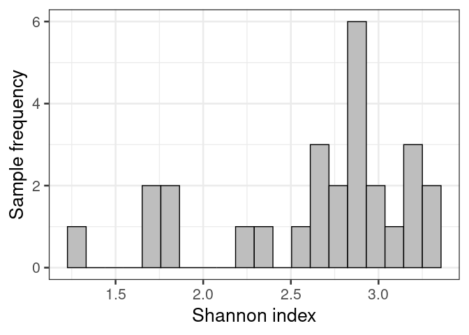
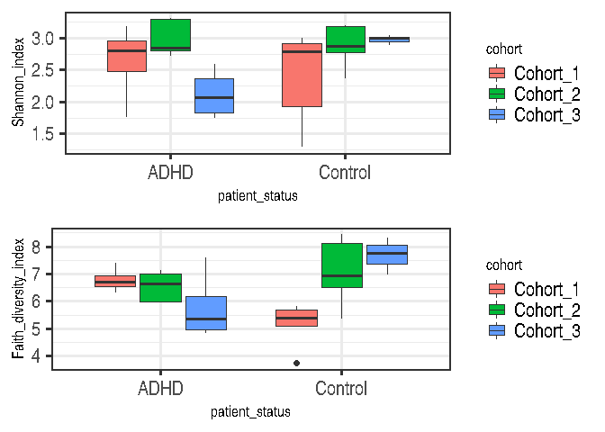

# Alpha diversity

This notebook calculates alpha diversity indices.

Alpha diversity is a quantity that measures diversity of taxa in one
sample. Higher numbers of unique taxa, and more even abundance
distributions within a sample yield larger values for alpha diversity.

Alpha diversity is an important quantity in microbiome research. The mia
package provides access to a wide variety of alpha diversity indices. As
an example, we show how to calculate Shannon and Faith diversity
indices.

Shannon index reflects how many different taxa there are and how evenly
they are distributed within a sample. Faith index additionally takes
into account the phylogenetic relations between the taxa when
quantifying the overall community diversity. In both indices, higher
values represent higher diversity.

    # Indices to be calculated. If we don't specify indices, by default, every index
    # is calculated.
    indices <- c("shannon", "faith")

    # Indices are stored in colData (i.e., sample metadata). We can specify the name
    # of column, or we can use the default name which is the name of index 
    # (i.e., "shannon" and "faith"). 
    names <- c("Shannon_index", "Faith_diversity_index")

    # Calculates indices
    tse <- estimateDiversity(tse, index = indices, name = names)

    # Shows the calculated indices
    knitr::kable(head(colData(tse)[names]))

<table>
<thead>
<tr class="header">
<th style="text-align: left;"></th>
<th style="text-align: right;">Shannon_index</th>
<th style="text-align: right;">Faith_diversity_index</th>
</tr>
</thead>
<tbody>
<tr class="odd">
<td style="text-align: left;">A110</td>
<td style="text-align: right;">1.765407</td>
<td style="text-align: right;">7.39224</td>
</tr>
<tr class="even">
<td style="text-align: left;">A12</td>
<td style="text-align: right;">2.716438</td>
<td style="text-align: right;">6.29378</td>
</tr>
<tr class="odd">
<td style="text-align: left;">A15</td>
<td style="text-align: right;">3.178103</td>
<td style="text-align: right;">6.60608</td>
</tr>
<tr class="even">
<td style="text-align: left;">A19</td>
<td style="text-align: right;">2.891987</td>
<td style="text-align: right;">6.79708</td>
</tr>
<tr class="odd">
<td style="text-align: left;">A21</td>
<td style="text-align: right;">2.841979</td>
<td style="text-align: right;">6.65110</td>
</tr>
<tr class="even">
<td style="text-align: left;">A23</td>
<td style="text-align: right;">2.797942</td>
<td style="text-align: right;">5.96246</td>
</tr>
</tbody>
</table>

Next we can visualize Shannon index with histogram.

    # ggplot needs data.frame as input. Because colData is DataFrame, it needs to be 
    # converted. 
    shannon_hist <- ggplot(as.data.frame(colData(tse)), 
                           aes(x = Shannon_index)) + 
      geom_histogram(bins = 20, fill = "gray", color = "black") +
      labs(x = "Shannon index", y = "Sample frequency")

    shannon_hist

    # # Same thing but done differently
    # # Creates histogram. With "break", number of bins can be specified. However, the
    # # value is taken as a suggestion, because hist() uses pretty() to calculate breakpoints.
    # hist(colData(tse)$Shannon_index, col = "green", breaks = 20,
    # xlab = "Shannon index",
    # ylab = "Sample frequency",
    # main = "Histogram of Shannon index")

To see, if there is dependency between Shannon and Faith, we can do
cross-plot i.e., scatter plot, where one index is on the x-axis and
another on the y-axis.

It seems that, there is a positive correlation between these two
indices.

    # # Does the same thing but differently
    # plot(colData(tse)$Shannon_index, colData(tse)$Faith_diversity_index,
    #      xlab = "Shannon index",
    #      ylab = "Faith diversity index",
    #      main = "plot()") +
    #   # Adds regression line
    #   abline(lm(colData(tse)$Faith_diversity_index ~ colData(tse)$Shannon_index)) 

    cross_plot <- ggplot2::ggplot(as.data.frame(colData(tse)), 
                                         aes(x = Shannon_index, y = Faith_diversity_index)) + 
      geom_point() + # Adds points
      geom_smooth(method=lm) + # Adds regression line
      xlab("Shannon index") + # x axis title
      ylab("Faith diversity index")  # y axis title

    cross_plot

    ## `geom_smooth()` using formula 'y ~ x'

## Visualization

Next let’s compare indices between different genotypes and diets.
Boxplot is suitable for that purpose.

    # Creates Shannon boxplot 
    shannon_box <- ggplot(as.data.frame(colData(tse)), aes(x = patient_status, 
                                                           y = Shannon_index, fill = cohort)) + 
      geom_boxplot() +
      theme(title = element_text(size = 12)) # makes titles smaller

    # Creates Faith boxplot 
    faith_box <- ggplot(as.data.frame(colData(tse)), aes(x = patient_status, 
                                                         y = Faith_diversity_index, 
                                                         fill = cohort)) + 
      geom_boxplot() +
      theme(title = element_text(size = 12)) # makes titles smaller

    # Puts them into same picture
    gridExtra::grid.arrange(shannon_box, faith_box, nrow = 2)

## Statistical testing and comparisons

To further investigate if diet explains the variation of Shannon index,
let’s do Wilcoxon test.

Wilcoxon test is similar to Student’s t-test, however, Student’s t-test
is parametric. It means that the data must be normally distributed.
Wilcoxon test is non-parametric so it doesn’t make any assumptions about
the distribution.

Wilcoxon test tests if there are statistical differences between two
groups. Here it tests, if western diet and control groups have different
Shannon index values. As we can see, there is no difference between
groups, because p-value is over 0.05, which is often used as a standard
cutoff point.

    # Wilcoxon test, where Shannon index is the variable that we are comparing. 
    # Diet - western or control - is the factor that we use for grouping. 
    wilcoxon_shannon <- wilcox.test(Shannon_index ~ patient_status, data = colData(tse))

    wilcoxon_shannon

    ## 
    ##  Wilcoxon rank sum exact test
    ## 
    ## data:  Shannon_index by patient_status
    ## W = 76, p-value = 0.4879
    ## alternative hypothesis: true location shift is not equal to 0

## Further resources

For more examples, see a dedicated section on alpha diversity in the
[online book](https://microbiome.github.io/OMA/).
