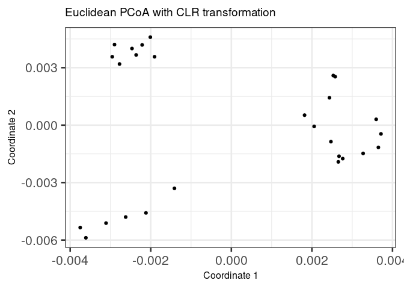
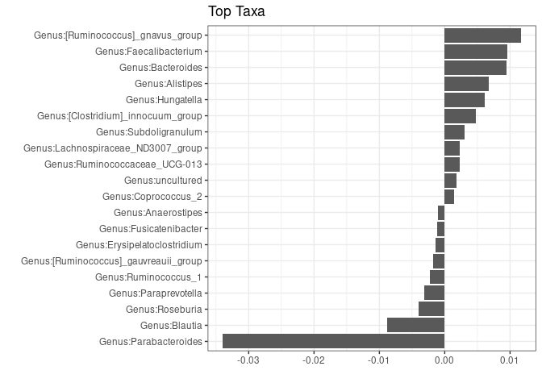

This notebook shows how to analyse and visualize beta diversity.

Beta diversity reflects the difference in microbial composition
between two samples. Similar samples have a low beta diversity.

Several different distance metrics are available. Some of the common
choices include Bray-Curtis, Unifrac, Jaccard, and Aitchison
index. Each of these dissimilarity measures emphasize different
aspects of similarity.


## Examples of PCoA with different settings

After estimating beta diversity we can vizualize sample similarity
with dimension reduction techniques such as Principal Coordinate
Analysis (PCoA).

PCoA takes a dissimilarity matrix as input. The output is usually a 2
or 3-dimensional euclidean space. The idea is to project the data so
that the distances between different samples are maximized. The
projection is often non-linear and designed to reveal local or global
structures in the data distribution.


### PCoA for ASV-level data with Bray-Curtis

Let us next show how to visualize sample similarities using the PCoA
method and a selected dissimilarity measure. We use the same tse data
object defined in the earlier notebooks.


```r
# Relative abundance table
rel_abund_assay <- assays(tse)$relabundance

# Transposes it to get taxa to columns
rel_abund_assay <- t(rel_abund_assay)

# Calculates Bray-Curtis distances between samples. Because taxa is in columns,
# it is used to compare different samples.
bray_curtis_dist <- vegan::vegdist(rel_abund_assay, method = "bray")

# Does principal coordinate analysis
bray_curtis_pcoa <- ecodist::pco(bray_curtis_dist)

# Creates a data frame from principal coordinates
bray_curtis_pcoa_df <- data.frame(pcoa1 = bray_curtis_pcoa$vectors[,1], 
                                  pcoa2 = bray_curtis_pcoa$vectors[,2])

# Creates a plot
bray_curtis_plot <- ggplot(data = bray_curtis_pcoa_df, aes(x=pcoa1, y=pcoa2)) +
  geom_point() +
  labs(x = "Coordinate 1",
       y = "Coordinate 2", 
       title = "Bray-Curtis PCoA with relative abundances") 
  theme(title = element_text(size = 10)) # makes titles smaller
```

```
## List of 1
##  $ title:List of 11
##   ..$ family       : NULL
##   ..$ face         : NULL
##   ..$ colour       : NULL
##   ..$ size         : num 10
##   ..$ hjust        : NULL
##   ..$ vjust        : NULL
##   ..$ angle        : NULL
##   ..$ lineheight   : NULL
##   ..$ margin       : NULL
##   ..$ debug        : NULL
##   ..$ inherit.blank: logi FALSE
##   ..- attr(*, "class")= chr [1:2] "element_text" "element"
##  - attr(*, "class")= chr [1:2] "theme" "gg"
##  - attr(*, "complete")= logi FALSE
##  - attr(*, "validate")= logi TRUE
```

```r
bray_curtis_plot
```

<!-- -->


### PCoA for ASV-level data with Aitchison distance

Aitchison distance corresponds to Euclidean distances between CLR
transformed sample abundance vectors.


```r
# Does clr transformation. Pseudocount is added, because data contains zeros. 
tse <- transformCounts(tse, method = "clr", pseudocount = 1)

# Gets clr table
clr_assay <- assays(tse)$clr

# Transposes it to get taxa to columns
clr_assay <- t(clr_assay)

# Calculates Euclidean distances between samples. Because taxa is in columns,
# it is used to compare different samples.
euclidean_dist <- vegan::vegdist(clr_assay, method = "euclidean")


# Does principal coordinate analysis
euclidean_pcoa <- ecodist::pco(euclidean_dist)

# Creates a data frame from principal coordinates
euclidean_pcoa_df <- data.frame(pcoa1 = euclidean_pcoa$vectors[,1], 
                                pcoa2 = euclidean_pcoa$vectors[,2])

# Creates a plot
euclidean_plot <- ggplot(data = euclidean_pcoa_df, aes(x=pcoa1, y=pcoa2)) +
  geom_point() +
  labs(x = "Coordinate 1",
       y = "Coordinate 2",
       title = "Euclidean PCoA with CLR transformation") +
  theme(title = element_text(size = 12)) # makes titles smaller

euclidean_plot
```

<!-- -->


### PCoA aggregated to Phylum level

We use again the Aitchison distances in this example but this time we
use data that was aggregated to the phylum level in the earlier
examples.


```r
# Does clr transformation. Psuedocount is added, because data contains zeros. 
tse_phylum <- transformCounts(tse_phylum, method = "clr", pseudocount = 1)

# Gets clr table
clr_phylum_assay <- assays(tse_phylum)$clr

# Transposes it to get taxa to columns
clr_phylum_assay <- t(clr_phylum_assay)

# Calculates Euclidean distances between samples. Because taxa is in columns,
# it is used to compare different samples.
euclidean_phylum_dist <- vegan::vegdist(clr_assay, method = "euclidean")

# Does principal coordinate analysis
euclidean_phylum_pcoa <- ecodist::pco(euclidean_phylum_dist)

# Creates a data frame from principal coordinates
euclidean_phylum_pcoa_df <- data.frame(pcoa1 = euclidean_phylum_pcoa$vectors[,1], 
                                       pcoa2 = euclidean_phylum_pcoa$vectors[,2])

# Creates a plot
euclidean_phylum_plot <- ggplot(data = euclidean_phylum_pcoa_df, aes(x=pcoa1, y=pcoa2)) +
  geom_point() +
  labs(x = "Coordinate 1",
       y = "Coordinate 2",
       title = "Aitchison distances at Phylum level") +  
  theme(title = element_text(size = 12)) # makes titles smaller

euclidean_phylum_plot
```

<!-- -->

## Highlighting external variables on PCoA plot

### PCoA with discrete sample grouping variable shown with colors

We can add grouping variable to existing plots. Let's add coloring to the CLR transformed,
Genus level PCoA.


```r
# Adds coloring information to the data frame, creates new column
euclidean_patient_status_pcoa_df <- cbind(euclidean_pcoa_df,
                             patient_status = colData(tse)$patient_status)

# Creates a plot
euclidean_patient_status_plot <- ggplot(data = euclidean_patient_status_pcoa_df, 
                                        aes(x=pcoa1, y=pcoa2,
                                            color = patient_status)) +
  geom_point() +
  labs(x = "Coordinate 1",
       y = "Coordinate 2",
       title = "PCoA with Aitchison distances") +
  theme(title = element_text(size = 12)) # makes titles smaller

euclidean_patient_status_plot
```

<!-- -->


### PCoA with continuous sample grouping variable shown with colors

We can also use continues values to group variables. Let's use Shannon diversity
index that we calculated in "Alpha diversity" notebook.


```r
# Adds coloring information to the data frame, creates new column
euclidean_shannon_pcoa_df <- cbind(euclidean_pcoa_df,
                             shannon = colData(tse)$Shannon_index)

# Creates a plot
euclidean_shannon_plot <- ggplot(data = euclidean_shannon_pcoa_df, 
                                 aes(x=pcoa1, y=pcoa2,
                                     color = shannon)) + 
  geom_point() +
  labs(x = "Coordinate 1",
       y = "Coordinate 2",
       title = "PCoA with Aitchison distances") +
  theme(title = element_text(size = 12)) # makes titles smaller

euclidean_shannon_plot
```

<!-- -->


## Clustering example

### Dirichlet-Multinomial Mixtures

One technique that allows to search for groups of samples that are
similar to each other is the [Dirichlet-Multinomial Mixture
Model](https://journals.plos.org/plosone/article?id=10.1371/journal.pone.0030126). In
DMM, we first determine the number of clusters (k) that best fit the
data (model evidence) using Laplace approximation. After fitting the
model with k clusters, we obtain for each sample k probabilities that
reflect the probability that a sample belongs to the given cluster.

Let's cluster the data with DMM clustering. 


```r
# Runs model and calculates the most likely number of clusters from 1 to 7. 
# For this small data, takes about 10 seconds. For larger data, can take much longer
# because this demands lots of resources. 
tse_dmn <- runDMN(tse, name = "DMN", k = 1:7)
```


```r
# It is stored in metadata
tse_dmn
```

```
## class: TreeSummarizedExperiment 
## dim: 151 27 
## metadata(1): DMN
## assays(3): counts relabundance clr
## rownames(151): 1726470 1726471 ... 17264756 17264757
## rowData names(6): Kingdom Phylum ... Family Genus
## colnames(27): A110 A12 ... A35 A38
## colData names(6): patient_status cohort ... Shannon_index Faith_diversity_index
## reducedDimNames(0):
## mainExpName: NULL
## altExpNames(0):
## rowLinks: a LinkDataFrame (151 rows)
## rowTree: 1 phylo tree(s) (151 leaves)
## colLinks: NULL
## colTree: NULL
```

Return information on metadata that the object contains.


```r
names(metadata(tse_dmn))
```

```
## [1] "DMN"
```

This returns a list of DMN objects for a closer investigation.


```
## [[1]]
## class: DMN 
## k: 1 
## samples x taxa: 27 x 151 
## Laplace: 12049.73 BIC: 12271.38 AIC: 12173.55 
## 
## [[2]]
## class: DMN 
## k: 2 
## samples x taxa: 27 x 151 
## Laplace: 11441.01 BIC: 12161.29 AIC: 11964.97 
## 
## [[3]]
## class: DMN 
## k: 3 
## samples x taxa: 27 x 151 
## Laplace: 11059.99 BIC: 12266.31 AIC: 11971.51 
## 
## [[4]]
## class: DMN 
## k: 4 
## samples x taxa: 27 x 151 
## Laplace: 11417.52 BIC: 13047.39 AIC: 12654.11 
## 
## [[5]]
## class: DMN 
## k: 5 
## samples x taxa: 27 x 151 
## Laplace: 11217.5 BIC: 13305.58 AIC: 12813.8 
## 
## [[6]]
## class: DMN 
## k: 6 
## samples x taxa: 27 x 151 
## Laplace: 11407.97 BIC: 13774.56 AIC: 13184.3 
## 
## [[7]]
## class: DMN 
## k: 7 
## samples x taxa: 27 x 151 
## Laplace: 11428.83 BIC: 14172.79 AIC: 13484.06
```


Show Laplace approximation (model evidence) for each model of the k models.


```r
plotDMNFit(tse_dmn, type = "laplace")
```

<!-- -->

Return the model that has the best fit.


```r
getBestDMNFit(tse_dmn, type = "laplace")
```

```
## class: DMN 
## k: 3 
## samples x taxa: 27 x 151 
## Laplace: 11059.99 BIC: 12266.31 AIC: 11971.51
```


### PCoA for ASV-level data with Bray-Curtis; with DMM clusters shown with colors

Group samples and return DMNGroup object that contains a summary.
Patient status is used for grouping.


```r
dmn_group <- calculateDMNgroup(tse_dmn, variable = "patient_status", 
                             exprs_values = "counts", k = 3)

dmn_group
```

```
## class: DMNGroup 
## summary:
##         k samples taxa      NLE    LogDet  Laplace      BIC      AIC
## ADHD    3      13  151 6018.131 -345.0946 5427.467 6601.657 6473.131
## Control 3      14  151 6647.269 -148.0811 6155.112 7247.655 7102.269
```

Mixture weights  (rough measure of the cluster size).


```r
DirichletMultinomial::mixturewt(getBestDMNFit(tse_dmn))
```

```
##          pi    theta
## 1 0.4814815 31.27754
## 2 0.2962963 47.34433
## 3 0.2222222 92.27428
```


Samples-cluster assignment probabilities.


```r
head(DirichletMultinomial::mixture(getBestDMNFit(tse_dmn)))
```

```
##               [,1]          [,2]          [,3]
## A110  1.000000e+00 1.246951e-144 7.560551e-205
## A12  9.805466e-117  6.106507e-93  1.000000e+00
## A15   1.000000e+00 9.479092e-119 3.386199e-234
## A19  5.360015e-112 1.814865e-107  1.000000e+00
## A21   2.140447e-93  4.714803e-96  1.000000e+00
## A23   1.000000e+00 8.797010e-111 1.934780e-161
```

Contribution of samples to each component.


```r
head(DirichletMultinomial::fitted(getBestDMNFit(tse_dmn)))
```

```
##                 [,1]        [,2]       [,3]
## 1726470  6.352132461 2.898843474 20.1893646
## 1726471  5.287865948 0.002047286  0.1532233
## 17264731 0.001248689 9.144396540  2.0112046
## 17264726 0.140479806 1.363560557  7.5894528
## 1726472  2.104171994 3.523602044  2.6656752
## 17264724 0.072365285 0.002047286  9.8545964
```

Get the assignment probabilities


```r
prob <- DirichletMultinomial::mixture(getBestDMNFit(tse_dmn))
# Add column names
colnames(prob) <- c("comp1", "comp2", "comp3")

# For each row, finds column that has the highest value. Then extract the column 
# names of highest values.
vec <- colnames(prob)[max.col(prob,ties.method = "first")]

# Creates a data frame that contains principal coordinates and DMM information
euclidean_dmm_pcoa_df <- cbind(euclidean_pcoa_df,
                               dmm_component = vec)

# Creates a plot
euclidean_dmm_plot <- ggplot(data = euclidean_dmm_pcoa_df, 
                             aes(x=pcoa1, y=pcoa2,
                                 color = dmm_component)) +
  geom_point() +
  labs(x = "Coordinate 1",
       y = "Coordinate 2",
       title = "PCoA with Aitchison distances") +  
  theme(title = element_text(size = 12)) # makes titles smaller

euclidean_dmm_plot
```

<!-- -->


## Estimating associations with an external variable

Next we show how the quantify the strength of association between the
variation in community composition (beta diversity) and external
factors.

The standard way to do this is to perform a so-called permutational
multivariate analysis of variance (PERMANOVA) test.


```r
# Relative abundance table
rel_abund_assay <- assays(tse)$relabundance

# Transposes it to get taxa to columns
rel_abund_assay <- t(rel_abund_assay)

permanova_cohort <- vegan::adonis(rel_abund_assay ~ cohort,
                                  data = colData(tse),
                                  permutations = 9999)

# P-value
print(paste0("Different different cohorts and variance of abundance between samples, p-value: ", 
             as.data.frame(permanova_cohort$aov.tab)["cohort", "Pr(>F)"]))
```

```
## [1] "Different different cohorts and variance of abundance between samples, p-value: 0.7427"
```

As we see, the cohort variable is not significantly associated with
microbiota composition (p-value is over 0.05).

We can, however, visualize those taxa whose abundance are the most
different between cohorts. This gives us information which taxa's
abundances tend to differ between different cohorts.

In order to do that, we need coefficients of taxa.


```r
# Gets the coefficients
coef <- coefficients(permanova_cohort)["cohort1",]

# Gets the highest coefficients
top.coef <- sort(head(coef[rev(order(abs(coef)))],20))

# Plots the coefficients
top_taxa_coeffient_plot <- ggplot(data.frame(x = top.coef,
                                             y = factor(names(top.coef),
                                                        unique(names(top.coef)))),
                                  aes(x = x, y = y)) +
  geom_bar(stat="identity") +
  labs(x="", y="", title="Top Taxa") +
  theme_bw()

top_taxa_coeffient_plot
```

<!-- -->

The above plot shows taxa as code names, and it is hard to tell which
bacterial groups they represent. It is easy to add human readable
names. The lowest available taxonomic level is Genus, so let's first
agglomerate taxa to Genus level.


```r
# Agglomerates data to Genus level
tse_genus <- agglomerateByRank(tse, rank = "Genus")

# Relative abundance table
rel_abund_assay_genus <- assays(tse_genus)$relabundance

# Transposes it to get taxa to columns
rel_abund_assay_genus <- t(rel_abund_assay_genus)

permanova_cohort_genus <- vegan::adonis(rel_abund_assay_genus ~ cohort,
                                        data = colData(tse_genus),
                                        permutations = 9999)

# P-value
print(paste0("Different different cohorts and variance of abundance between samples, p-value: ", 
             as.data.frame(permanova_cohort_genus$aov.tab)["cohort", "Pr(>F)"]))
```

```
## [1] "Different different cohorts and variance of abundance between samples, p-value: 0.7829"
```


```r
# Gets the coefficients
coef <- coefficients(permanova_cohort_genus)["cohort1",]

# Gets the highest coefficients
top.coef <- sort(head(coef[rev(order(abs(coef)))],20))

# Plots the coefficients
top_taxa_coeffient_genus_plot <- ggplot(data.frame(x = top.coef,
                                                   y = factor(names(top.coef),
                                                              unique(names(top.coef)))),
                                        aes(x = x, y = y)) +
  geom_bar(stat="identity") +
  labs(x="", y="", title="Top Taxa") +
  theme_bw()

top_taxa_coeffient_genus_plot
```

<!-- -->


## Further resources

For more examples, see a dedicated section on beta diversity in the
[online book](https://microbiome.github.io/OMA/).

