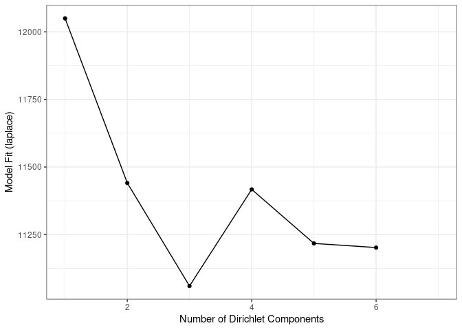
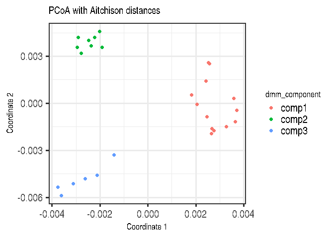

# Dirichlet-Multinomial Mixtures

This notebook does DMM analysis.

One technique that allows to search for groups of samples that are
similar to each other is the [Dirichlet-Multinomial Mixture
Model](https://journals.plos.org/plosone/article?id=10.1371/journal.pone.0030126).
In DMM, we first determine the number of clusters (k) that best fit the
data (model evidence) using Laplace approximation. After fitting the
model with k clusters, we obtain for each sample k probabilities that
reflect the probability that a sample belongs to the given cluster.

Let’s cluster the data with DMM clustering.

    # Runs model and calculates the most likely number of clusters from 1 to 7. 
    # For this small data, takes about 10 seconds. For larger data, can take much longer
    # because this demands lots of resources. 
    tse_dmn <- runDMN(tse, name = "DMN", k = 1:7)

    # It is stored in metadata
    tse_dmn

    ## class: TreeSummarizedExperiment 
    ## dim: 151 27 
    ## metadata(1): DMN
    ## assays(3): counts relabundance clr
    ## rownames(151): 1726470 1726471 ... 17264756 17264757
    ## rowData names(6): Kingdom Phylum ... Family Genus
    ## colnames(27): A110 A12 ... A35 A38
    ## colData names(6): patient_status cohort ... Shannon_index Faith_diversity_index
    ## reducedDimNames(0):
    ## mainExpName: NULL
    ## altExpNames(0):
    ## rowLinks: a LinkDataFrame (151 rows)
    ## rowTree: 1 phylo tree(s) (151 leaves)
    ## colLinks: NULL
    ## colTree: NULL

Return information on metadata that the object contains.

    names(metadata(tse_dmn))

    ## [1] "DMN"

This returns a list of DMN objects for a closer investigation.

    ## [[1]]
    ## class: DMN 
    ## k: 1 
    ## samples x taxa: 27 x 151 
    ## Laplace: 12049.73 BIC: 12271.38 AIC: 12173.55 
    ## 
    ## [[2]]
    ## class: DMN 
    ## k: 2 
    ## samples x taxa: 27 x 151 
    ## Laplace: 11704.81 BIC: 12399.15 AIC: 12202.83 
    ## 
    ## [[3]]
    ## class: DMN 
    ## k: 3 
    ## samples x taxa: 27 x 151 
    ## Laplace: 11059.62 BIC: 12266.31 AIC: 11971.51 
    ## 
    ## [[4]]
    ## class: DMN 
    ## k: 4 
    ## samples x taxa: 27 x 151 
    ## Laplace: 11417.58 BIC: 13047.39 AIC: 12654.11 
    ## 
    ## [[5]]
    ## class: DMN 
    ## k: 5 
    ## samples x taxa: 27 x 151 
    ## Laplace: 11217.58 BIC: 13305.58 AIC: 12813.8 
    ## 
    ## [[6]]
    ## class: DMN 
    ## k: 6 
    ## samples x taxa: 27 x 151 
    ## Laplace: 11202.28 BIC: 13718.9 AIC: 13128.65 
    ## 
    ## [[7]]
    ## class: DMN 
    ## k: 7 
    ## samples x taxa: 27 x 151 
    ## Laplace: 11428.3 BIC: 14172.79 AIC: 13484.06

Show Laplace approximation (model evidence) for each model of the k
models.

    plotDMNFit(tse_dmn, type = "laplace")

Return the model that has the best fit.

    getBestDMNFit(tse_dmn, type = "laplace")

    ## class: DMN 
    ## k: 3 
    ## samples x taxa: 27 x 151 
    ## Laplace: 11059.62 BIC: 12266.31 AIC: 11971.51

### PCoA for ASV-level data with Bray-Curtis; with DMM clusters shown with colors

Group samples and return DMNGroup object that contains a summary.
Patient status is used for grouping.

    dmn_group <- calculateDMNgroup(tse_dmn, variable = "patient_status", 
                                 exprs_values = "counts", k = 3)

    dmn_group

    ## class: DMNGroup 
    ## summary:
    ##         k samples taxa      NLE    LogDet  Laplace      BIC      AIC
    ## ADHD    3      13  151 6018.131 -345.0888 5427.470 6601.657 6473.131
    ## Control 3      14  151 6647.269 -148.3686 6154.968 7247.655 7102.269

Mixture weights (rough measure of the cluster size).

    DirichletMultinomial::mixturewt(getBestDMNFit(tse_dmn))

    ##          pi    theta
    ## 1 0.4814815 31.27752
    ## 2 0.2962963 47.34448
    ## 3 0.2222222 92.27436

Samples-cluster assignment probabilities.

    head(DirichletMultinomial::mixture(getBestDMNFit(tse_dmn)))

    ##               [,1]          [,2]          [,3]
    ## A110  1.000000e+00 1.257714e-144 7.589289e-205
    ## A12  9.772996e-117  6.138536e-93  1.000000e+00
    ## A15   1.000000e+00 9.551686e-119 3.385300e-234
    ## A19  5.342379e-112 1.825156e-107  1.000000e+00
    ## A21   2.133996e-93  4.743901e-96  1.000000e+00
    ## A23   1.000000e+00 8.864031e-111 1.942067e-161

Contribution of samples to each component.

    head(DirichletMultinomial::fitted(getBestDMNFit(tse_dmn)))

    ##                 [,1]       [,2]       [,3]
    ## 1726470  6.352062462 2.89882255 20.1893246
    ## 1726471  5.287813161 0.00204777  0.1532203
    ## 17264731 0.001248542 9.14439269  2.0111940
    ## 17264726 0.140479803 1.36350886  7.5894691
    ## 1726472  2.104218630 3.52360209  2.6657139
    ## 17264724 0.072364578 0.00204777  9.8546179

Get the assignment probabilities

    prob <- DirichletMultinomial::mixture(getBestDMNFit(tse_dmn))
    # Add column names
    colnames(prob) <- c("comp1", "comp2", "comp3")

    # For each row, finds column that has the highest value. Then extract the column 
    # names of highest values.
    vec <- colnames(prob)[max.col(prob,ties.method = "first")]

    # Creates a data frame that contains principal coordinates and DMM information
    euclidean_dmm_pcoa_df <- cbind(euclidean_pcoa_df,
                                   dmm_component = vec)

    # Creates a plot
    euclidean_dmm_plot <- ggplot(data = euclidean_dmm_pcoa_df, 
                                 aes(x=pcoa1, y=pcoa2,
                                     color = dmm_component)) +
      geom_point() +
      labs(x = "Coordinate 1",
           y = "Coordinate 2",
           title = "PCoA with Aitchison distances") +  
      theme(title = element_text(size = 12)) # makes titles smaller

    euclidean_dmm_plot

